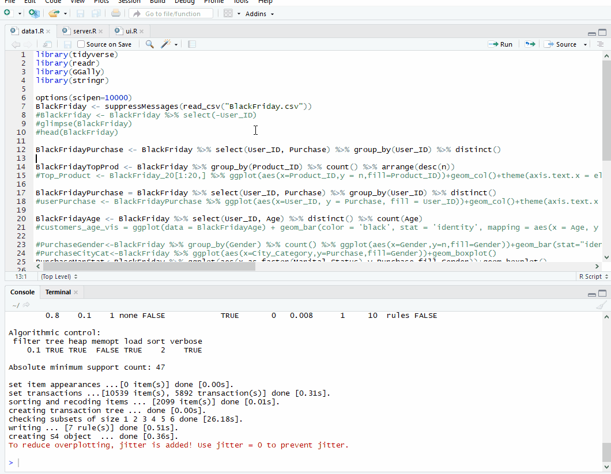
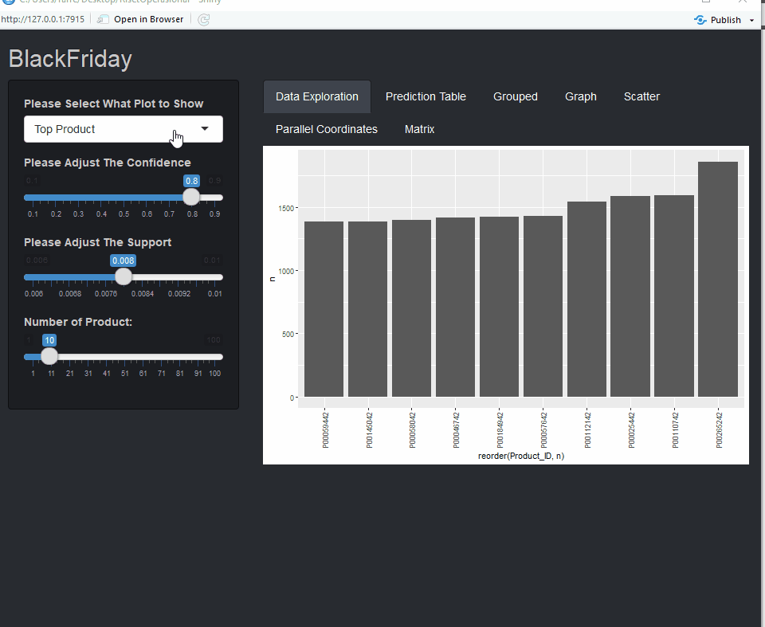
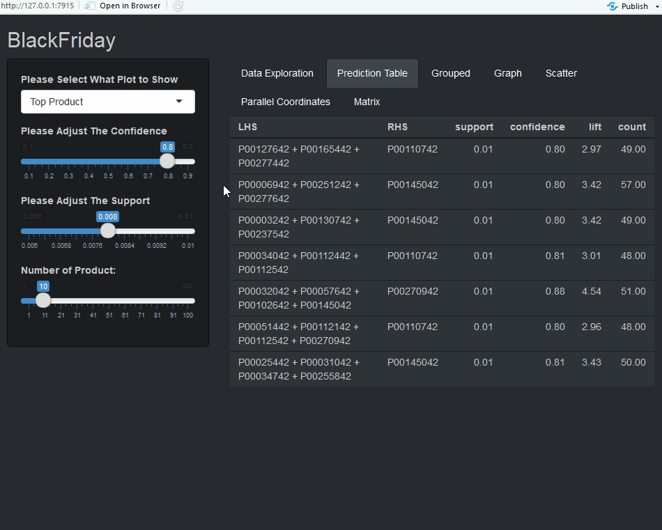
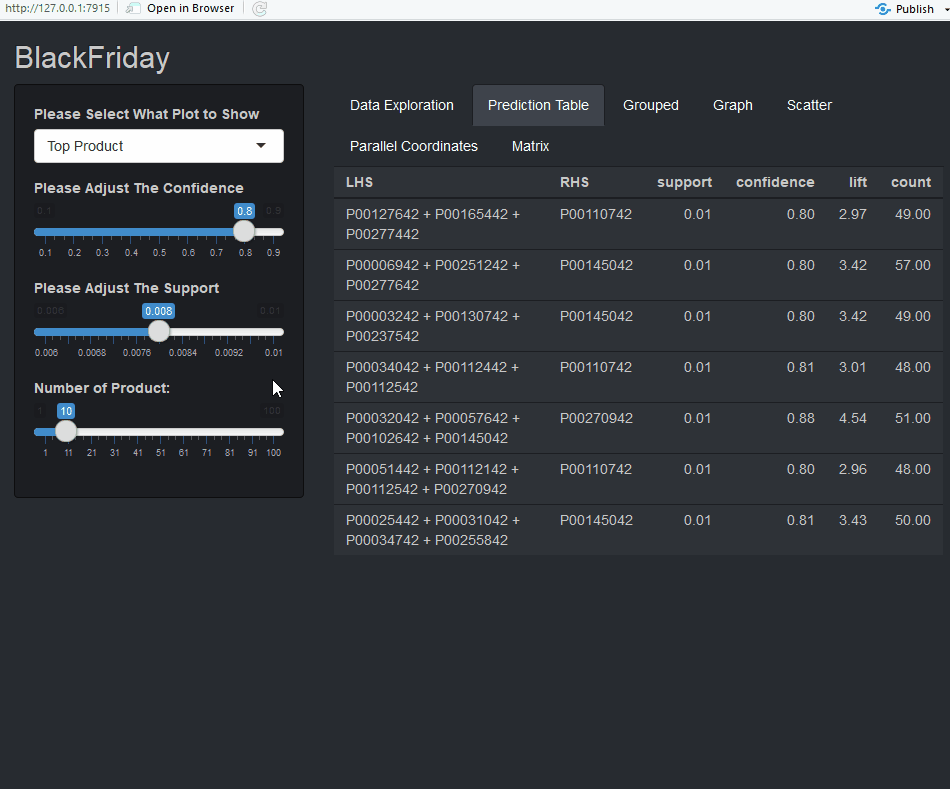
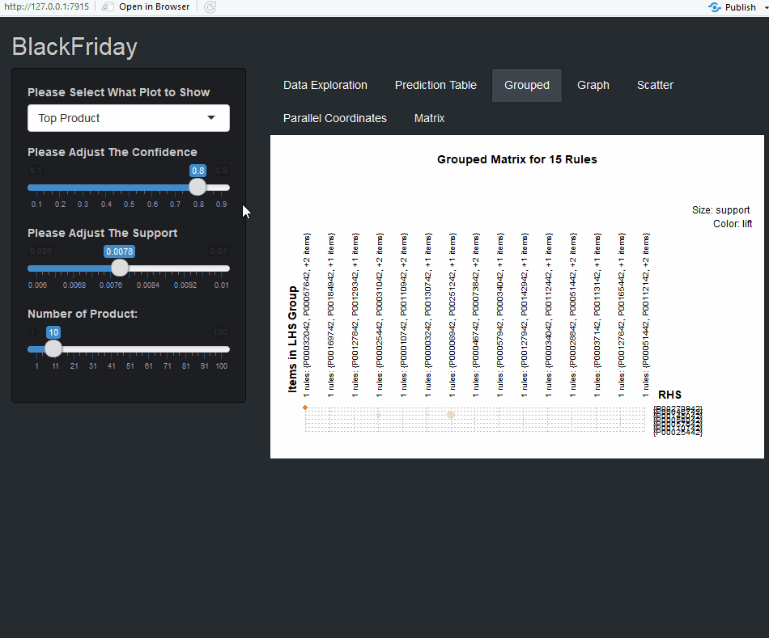
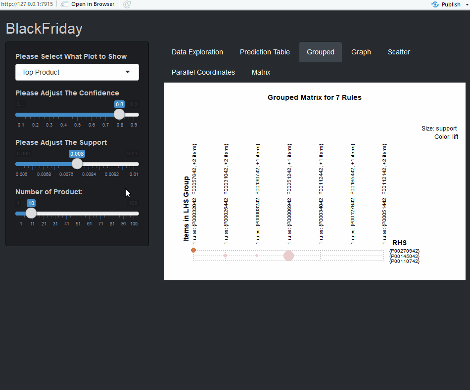

# Riset Operasional - [Black Friday](https://www.kaggle.com/mehdidag/black-friday)
Repository untuk Project Riset Operasional

## Machine Learning : Apriori (Association Rule Learning)
We will be using Apriori algorithm to predict costumer transactions, In other words, the algorithm solves the problem, "People who bought 'Product A' also bought 'Product B' ."

### Requirements
- [R-3.5.3](https://cran.r-project.org/bin/windows/base/) (latest)
- [RStudio 1.2.1335](https://www.rstudio.com/products/rstudio/download/)

### Required R Packages (case-sensitive)
- shiny
- tidyverse
- readr
- GGally
- stringr
- shinythemes
- gridExtra
- arules
- scales

## Into Association Rules and *Apriori* algorithm
Association Rules is a technique to uncover how items are associated to each other. Three ways to measure association:
1. Support: An indication on how often an itemset appears in the dataset. It's the number of transactions that includes A and B as a percentage of the total number of transactions. It measures how often a set of items are being bought together as a percentage of all transactions.

Support formula: (A + B) / Total

tl;dr A fraction of all transactions that contain both A and B.

2. Confidence: An indication on how often the rule is true. It's the ratio of the purchases that contains A and B, to the transactions that contains A.

Confidence formula: (A + B) / A

tl;dr How often B appears in transactions that only contain A.

3. Lift: Ratio of confidence to *expected* confidence. Expected confidence is the confidence divided by the frequency of B. The higher the lift, the stronger the association

tl;dr How much our confidence has increased that B will be purchased given that A was purchased.

## Installing
1. Download all files and put them in the same folder
2. Download all the required R packages
3. Open server.R, data1.R, and ui.R on RStudio
4. Click Run App 
  

## Program Features
### Data Exploration
  
Simply click on "Select Plot" to open the dropdown menu and change the plot. The values of the plot can be changed using the bottom-most slider.

### Prediction Table

Modifies the confidence for the tables.

Modifies the support for the tables.

## Grouped

Authors:
- Farrell Nathaniel (01082170002)
- Ferinzhy Halik
- Grand Marcell (01082170016

References:
[Black Friday Examined (EDA + Apriori)](https://www.kaggle.com/dabate/black-friday-examined-eda-apriori/notebook)
[Association of rule learning](https://en.wikipedia.org/wiki/Association_rule_learning)
[Explanation of Market Basket Model](https://infocenter.informationbuilders.com/wf80/index.jsp?topic=%2Fpubdocs%2FRStat16%2Fsource%2Ftopic49.htm)
[Association rules](https://www.solver.com/xlminer/help/association-rules)

